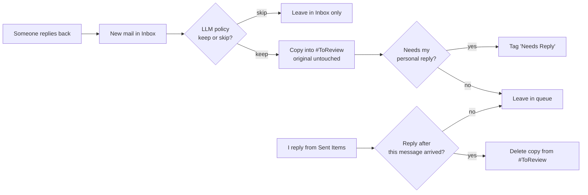

# Automate Your Inbox — An AI Chief‑of‑Staff for Email

*Intelligent, in‑tenant email triage with Microsoft Scout + WorkIQ.*

> **TL;DR** — One prompt turns Scout into an AI chief‑of‑staff for your inbox.
> - **Copies** only what matters into a review folder — your Inbox is never touched.
> - **Flags** what needs your personal reply, and **self‑clears** the moment you answer.
> - **Free for Microsoft employees**, and unlike third‑party AI email tools, nothing leaves the tenant.

**In a hurry?** Read the one‑page [Executive Summary](./docs/EXEC-SUMMARY.md). Ready to build it? Jump to [Quick start](#quick-start).

---

## Why this exists

Classic Outlook rules match on **senders and keywords**. They can't tell a genuine customer escalation from an automated alert that happens to share the same word — so the mail carrying real business risk is exactly the mail that gets buried. They're also AND‑only within a rule (so "from any of these people **or** about any of these topics" needs many brittle rules), and they need constant hand‑maintenance.

This project replaces all of that with **one natural‑language policy** interpreted by an LLM, executed by an in‑tenant agent that **copies** (never moves) the mail that matters into a review folder, **flags** what needs your reply, and **self‑clears** items as you answer.

| Classic Outlook rules | This engine |
|---|---|
| Match sender / exact keywords only | Understands intent (deals, escalations, career‑relevant) |
| OR logic needs many separate rules | One natural‑language rule set |
| Cannot read context | Reads subject + body + recipients and reasons |
| Moves or flags messages | **Copies** — your Inbox stays intact |
| Folder just fills up over time | **Self‑clearing** to‑do queue — drops what you've answered, resurfaces new replies |
| Can't tell which mail needs your response | **Auto‑flags** the emails that need your reply |

---

## Quick start

**Prerequisite:** Microsoft Scout with WorkIQ enabled and signed in to Microsoft 365. New to Scout? Start with [Get started with Microsoft Scout](https://learn.microsoft.com/en-us/microsoft-scout/get-started) on Microsoft Learn.

1. Within Outlook, create a new folder under your Inbox (e.g. `#ToReview`).
2. Paste the prompt in [`email-triage.prompt.md`](./email-triage.prompt.md) into Scout, filling in the `[bracketed]` fields for your role (leadership chain, close collaborators, product, key customer domains, etc.).
3. Scout back‑tests the last 30 days into that folder and sets up a **paused** recurring automation.
4. Review what landed; tune ("also keep anything from `[domain]`", "stop copying `[newsletter]`").
5. Tell Scout to **turn the automation on** (hourly or a daily time).

That's it — no build, no deployment, no new license.

---

## How it works

Each scheduled cycle, the agent runs against Microsoft Graph under **your own credentials**:

```
Inbox (source of truth, never mutated)
   │
   ├─(0) Build reply state ── read Sent Items → { conversation → latest sent time }
   │
   ├─(1) Reconcile queue ──── for each copy in #ToReview:
   │                            delete it IFF you replied AFTER that message arrived
   │                            (per‑message, conversation‑scoped)
   │
   ├─(2) Ingest new mail ──── messages received since last run
   │
   ├─(3) Judge relevance ──── LLM applies your natural‑language keep/skip policy
   │
   └─(4) Copy + flag ──────── copy kept messages into #ToReview (originals untouched);
                              if it needs your personal reply → tag "Needs Reply"
```



### Key mechanics (the interesting parts)

- **Copy, not move.** Uses Graph `POST /me/messages/{id}/copy` with a `destinationId`, so the Inbox original and unread counts are untouched. The queue is a *projection* of the inbox, not a mutation of it.
- **Per‑message reply reconciliation.** A queued copy is removed only when you sent a reply **after that specific message's receipt time** (scoped by `conversationId`). Because the test is per‑message — not per‑conversation — replying earlier in a thread does **not** hide a newer follow‑up.
- **Re‑surfacing.** A later inbound reply is a *new* message (new `internetMessageId`, newer timestamp), so it's ingested and flagged on its own merits. With conversation view **off** in the folder, each message shows individually.
- **Needs‑Reply flag.** Applied to the copy via `PATCH /me/messages/{id}` setting `categories: ["Needs Reply"]` (an Outlook master category). Filter/sort the folder by that category to get a clean action list. To dismiss something that doesn't need a reply, just remove the category — the agent never re‑flags an existing item.
- **De‑duplication.** Keyed on `internetMessageId` against what's already in the folder, so nothing is copied twice.
- **In‑tenant.** All calls run under your Microsoft 365 permissions; message content never leaves the tenant.

---

## Options considered

Approaches that add intelligence and/or run without your laptop, compared on the axes that matter:

| Option | Runs w/o your laptop | AI judgment | Copy (Inbox intact) | Self‑clears after reply | Flags "needs reply" | Cost & main limitation |
|---|---|---|---|---|---|---|
| Server‑side Outlook rules | Yes (Exchange Online) | No — keyword/sender only | Yes (Graph `copyToFolder`; the rules UI is usually move‑only) | No — fire on arrival only | No | Included; but no grasp of meaning, brittle boolean logic |
| Power Automate + AI Builder / Azure OpenAI | Yes (cloud flow) | Yes | Only via the Graph HTTP connector — may be DLP‑blocked; the allowed Outlook connector can only **move** | Yes (scheduled flow) | Yes | Premium + AI capacity; DLP can force a move that pulls mail out of your Inbox |
| Azure Logic App / Function + Graph + Azure OpenAI | Yes (hosted in Azure) | Yes | Yes — full Graph `copyToFolder` | Yes | Yes | Azure subscription; most engineering + app registration |
| Native M365 Copilot — "Prioritize my inbox" | Yes (cloud) | Yes — by your stated priorities | No — flags/summarizes in place, no folder routing | No | Partial — priority, not "awaiting your reply" | M365 Copilot license; not custom folder rules |
| **Microsoft Scout (this project)** | **No — runs locally** | **Yes — your own words** | **Yes — copies; originals untouched** | **Yes** | **Yes** | **No extra license; needs your laptop on + Scout running** |

> **Self‑clearing note:** auto‑removing mail you've replied to (and re‑surfacing new replies) needs a **stateful** automation — Scout, Power Automate, and a Logic App/Function can all do it; classic server‑side rules cannot, since they only act on arrival.

### Why Scout

Genuine AI judgment with essentially zero setup, rules in your own words, and a safe **copy** into a review folder that never touches your inbox — all **in‑tenant**, on tooling Microsoft employees already have.

**The one limitation:** Scout runs locally, so your laptop must be on (awake) with Scout running for the scheduled triage to fire. For fully unattended operation, a cloud option (Power Automate or a Logic App/Function) is the next step — subject to license and DLP clearance, and if the Graph copy connector is DLP‑blocked, Power Automate can only *move* mail out of your Inbox rather than copy it.

---

## Limitations & sharp edges (read before adopting)

- **Laptop must be on.** Local execution; if the machine is asleep/off past the scan window, that window is skipped.
- **Up to ~1 hour latency** on an hourly cadence before new mail appears / replied mail clears.
- **Reply detection is conversation‑scoped.** A reply that breaks the thread (e.g., a heavily changed subject that starts a new conversation) could be missed by the auto‑clear.
- **Folder enumeration caps.** Some Graph folder queries page‑cap around 250 items; large one‑time backfills should page by date window.
- **"Needs Reply" is a judgment call.** It's tuned for precision (a real question/request/awaiting‑you), so it can occasionally miss or over‑flag; you can un‑flag or re‑tune anytime.

---

## FAQ

**Does it move or delete my mail?** No. It **copies** into the review folder; your Inbox originals are never moved or deleted. Auto‑clear deletes only the *copy* (to Deleted Items).

**If I delete a flagged copy without replying, does it come back?** No, in the normal case — the scan window only looks at recently arrived mail, so an older dismissed item isn't re‑ingested. Prefer **un‑flagging** over deleting to keep a record.

**If I un‑flag an email and a follow‑up arrives later, will I see it?** Yes — the follow‑up is a new message, so it's copied in and flagged on its own.

**Where does my data go?** Nowhere external. Everything runs under your M365 permissions, in‑tenant.

---

## Adapting this for your team

The prompt is a template. Swap in your own leadership chain, close collaborators, product/keywords, strategic customer domains, and any always‑keep/always‑skip specifics. Managers should add *"anything from my direct reports"* — one of the most common and most damaging things classic rules miss.

See [`email-triage.prompt.md`](./email-triage.prompt.md) for the full, fill‑in‑the‑blanks prompt.

---

*Built on Microsoft Scout + WorkIQ + Microsoft Graph. Contributions welcome — see [`CONTRIBUTING.md`](./CONTRIBUTING.md). Security policy: [`SECURITY.md`](./SECURITY.md).*

*Questions, feedback, or feature enhancement requests? Contact **Dave Burkhardt** — [dburkhardt@microsoft.com](mailto:dburkhardt@microsoft.com).*
